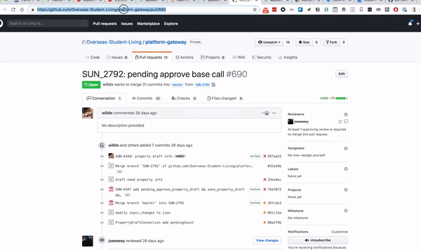

## How to use
1. Allow alfred to system events. 
1. awake alfred, type plzreview
2. input pr url and enter.

## Demo


## How to set default `github_token` and `slack channel`

```bash
cat >> /usr/local/etc/alfred_pr_review_config.json <<EOF
{ "github_token": "xxxxxxxx", "slack_channel": "sun_updates" }
EOF
```